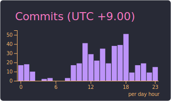

  
  
  

  
  

<picture>
  <source media="(prefers-color-scheme: dark)" srcset="https://raw.githubusercontent.com/saitenntaisei/saitenntaisei/output/github-snake-dark.svg">
  <source media="(prefers-color-scheme: light)" srcset="https://raw.githubusercontent.com/saitenntaisei/saitenntaisei/outputgithub-snake.svg">
  
</picture>

  
  

